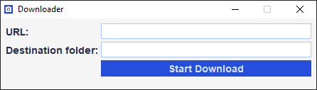

# Downloader :camera:

> Project that downloads photos from the chosen website.

-----

### Screen

### How to build

__1° step__: Run the __`build.bat`__ or __`build.sh`__ file, present in the root directory of this project.

__2° step__: After executing the first step, the __`downloader.jar`__ file will be generated in the directory `target`.
